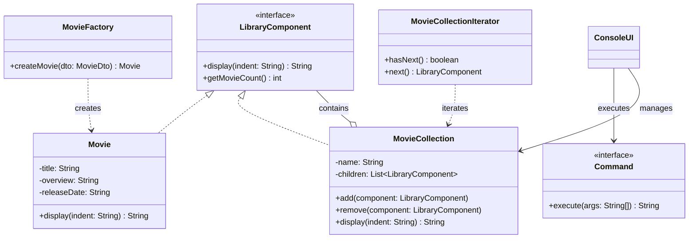

# Movie Library

## 1. Panoramica dell’applicazione
**Movie Library** è un'applicazione da riga di comando (CLI) sviluppata in Java SE per la gestione avanzata di una libreria cinematografica personale. Il progetto simula un caso d'uso reale in cui l'utente può catalogare film, organizzarli in collezioni gerarchiche, cercare titoli online tramite API esterne (TMDB) e salvare i dati in modo persistente.
L'applicazione è progettata per dimostrare la padronanza dei principi della programmazione a oggetti (OOP) e l'applicazione corretta dei principali **Design Pattern**, garantendo un codice robusto, estensibile e manutenibile.

## 2. Funzionalità principali
*   **Gestione Film**: Creazione di schede film con titolo, trama, data di uscita e ID univoco.
*   **Organizzazione Gerarchica**: Possibilità di creare raccolte arbitrarie (es. "Saga Marvel", "Horror Anni '80") che possono contenere sia film singoli che altre sotto-collezioni (Pattern Composite).
*   **Ricerca Online**: Integrazione diretta con *The Movie Database (TMDB)* per cercare film e importarne i metadati automaticamente.
*   **Viste e Iterazione**: Funzionalità per attraversare l'intera libreria e visualizzare i contenuti in modo formattato (Pattern Iterator).
*   **Persistenza**: Salvataggio e caricamento dello stato dell'intera libreria su file locale (`.ser` o JSON) utilizzando Java I/O.
*   **Interfaccia CLI**: Un'interfaccia testuale interattiva che guida l'utente attraverso tutte le operazioni disponibili con feedback visivi e gestione degli errori.

## 3. Architettura del progetto
Il progetto adotta un'architettura stratificata (Layered Architecture) per separare le responsabilità:

*   **UI Layer** (`com.movielibrary.ui`): Gestisce l'interazione con l'utente (input/output) e la formattazione dei dati. La classe `ConsoleUI` funge da controller principale.
*   **Application Layer** (`com.movielibrary.command`, `com.movielibrary.service`): Contiene la logica applicativa principale. I comandi (Command Pattern) orchestrano le operazioni, mentre i service (`LibraryStorageService`, `TmdbApiClient`) forniscono funzionalità di supporto.
*   **Domain Layer** (`com.movielibrary.model`, `com.movielibrary.factory`): Definisce le entità core del dominio (`Movie`, `MovieCollection`) e le regole di business.
*   **Infrastructure Layer** (`com.movielibrary.util`, `com.movielibrary.api`): Gestisce i dettagli di basso livello come la comunicazione HTTP e la configurazione.

### Decisioni progettuali
*   **Separazione DTO/Model**: Si utilizzano oggetti DTO (`MovieDto`) per il trasporto dati dall'API per non inquinare il modello di dominio con annotazioni di parsing JSON.
*   **Programmare per interfacce**: L'uso estensivo di interfacce (`Command`, `LibraryComponent`, `Iterator`) permette di sostituire le implementazioni senza impattare il resto del sistema.

## 4. Design pattern richiesti
Il progetto implementa i seguenti pattern obbligatori per risolvere problemi architetturali specifici:

*   **Factory Method** (`com.movielibrary.factory.MovieFactory`):
    Utilizzato per centralizzare la creazione degli oggetti `Movie`. Questo disaccoppia la logica di creazione dalla logica di business, permettendo in futuro di introdurre facilmente nuovi tipi di media (es. `Series`, `Documentary`) senza modificare il client.
*   **Composite** (`com.movielibrary.model.LibraryComponent` -> `Movie`, `MovieCollection`):
    Permette di trattare oggetti singoli (`Movie`) e composizioni di oggetti (`MovieCollection`) in modo uniforme. L'utente può aggiungere un film a una collezione o stampare una collezione intera con lo stesso metodo `display()`, sfruttando la struttura ad albero "parte-tutto".
*   **Iterator** (`com.movielibrary.iterator.MovieCollectionIterator`):
    Fornisce un modo sequenziale per accedere agli elementi della libreria senza esporre la sua rappresentazione interna (lista, albero, ecc.). Questo è fondamentale per operazioni come il salvataggio o la visualizzazione "flat" della libreria.
*   **Command** (`com.movielibrary.command.Command`):
    Ogni operazione utente (`Add`, `Remove`, `Search`) è incapsulata in un oggetto. Ciò rende il sistema estensibile: aggiungere un nuovo comando richiede solo la creazione di una nuova classe, rispettando l'Open/Closed Principle.
*   **Exception Shielding** (`com.movielibrary.ui.ConsoleUI`):
    Le eccezioni di basso livello (es. `IOException`, `InterruptedException`) vengono catturate ai confini del sistema, loggate per il debug, e trasformate in messaggi user-friendly per non spaventare l'utente con stack trace incomprensibili.

## 5. Tecnologie core richieste
*   **Java Collections Framework**: Utilizzo di `List` (ArrayList) per la gestione ordinata dei comandi e dei film, e `Map` (HashMap) per il mapping veloce `nome_comando -> oggetto_comando`.
*   **Generics**: Utilizzati per garantire la type-safety a tempo di compilazione ed evitare cast espliciti (es. nelle liste di DTO).
*   **Java I/O**: Utilizzo di `ObjectOutputStream`/`ObjectInputStream` (o librerie JSON) all'interno di blocchi *try-with-resources* per garantire la corretta chiusura degli stream e la persistenza dei dati.
*   **Logging (SLF4J + Logback)**: Logging strutturato su diversi livelli (`INFO` per il flusso normale, `ERROR` per eccezioni). `System.out` è riservato esclusivamente all'interazione con l'utente, mentre i log tecnici finiscono su file/console dedicata.
*   **JUnit 5**: Suite di test unitari per verificare la logica di business (es. corretta aggiunta di film al Composite) e prevenire regressioni durante il refactoring.

## 6. Sicurezza e robustezza
*   **Input Sanitization**: Ogni input utente viene validato prima di essere processato. Ad esempio, la selezione numerica dei film controlla i limiti dell'array per evitare `IndexOutOfBoundsException`. I titoli vuoti vengono scartati.
*   **Controlled Exception Propagation**: Nessuna eccezione "cruda" viene mai mostrata a video. Il blocco `try-catch` nel loop principale della UI garantisce che l'applicazione non crashi mai inaspettatamente, mostrando invece un messaggio di errore controllato.
*   **No Hardcoded Secrets**: La API Key di TMDB non è scritta nel codice sorgente ma caricata dinamicamente da un file `config.properties` (o variabili d'ambiente), proteggendo le credenziali.

## 7. Struttura del repository
```text
movielibrary/
├── pom.xml                 # Gestione dipendenze Maven
├── src/
│   ├── main/
│   │   ├── java/com/movielibrary/
│   │   │   ├── api/        # Client HTTP per TMDB
│   │   │   ├── command/    # Implementazioni comandi (Command Pattern)
│   │   │   ├── factory/    # MovieFactory (Factory Pattern)
│   │   │   ├── iterator/   # Iterator personalizzato
│   │   │   ├── model/      # Movie, Collection (Composite Pattern)
│   │   │   ├── service/    # Servizi di storage e parsing
│   │   │   ├── ui/         # ConsoleUI e gestione input
│   │   │   └── Main.java   # Entry point
│   │   └── resources/
│   │       ├── config.properties # Configurazione sensibile
│   │       └── logback.xml       # Configurazione logging
│   └── test/java/          # Unit test JUnit
└── README.md
```

## 8. Setup ed esecuzione
### Requisiti
*   Java JDK 21 (o superiore)
*   Apache Maven 3.x

### Istruzioni
1.  **Compilazione**: Eseguire i test e pacchettizzare l'applicazione.
    ```bash
    mvn clean package
    ```
2.  **Configurazione**: Assicurarsi che `src/main/resources/config.properties` contenga una API Key valida.
3.  **Esecuzione**: Lanciare l'applicazione tramite il plugin exec di Maven o direttamente dal JAR.
    ```bash
    # Via Maven
    mvn exec:java -Dexec.mainClass="com.movielibrary.Main"
    
    # Via JAR (dopo il package)
    java -jar target/movielibrary-1.0-SNAPSHOT.jar
    ```

## 9. Esempi di utilizzo (CLI)

```bash
# Avvio applicazione
> Benvenuto in Movie Library!

# Cerca un film online (chiama ApiClient)
> cerca Inception
1: Inception (2010) - Un ladro che ruba segreti attraverso l'uso della tecnologia...
2: Inception: The Cobol Job (2010) - ...

# Aggiungi il primo risultato alla libreria (chiama Factory e Composite)
> aggiungi 1
Film "Inception" aggiunto correttamente alla libreria.

# Visualizza la struttura della libreria (Composite trasversale)
> vedi
La Mia Libreria
  - Film: Inception (Uscita: 2010-07-15)

# Rimuovi un film (indice basato sulla vista corrente)
> togli 1
Elemento rimosso.

# Salva lo stato su disco
> salva
Libreria salvata con successo in 'movielibrary.ser'.

# Aiuto comandi
> aiuto
Comandi disponibili: cerca, aggiungi, togli, vedi, salva, carica, esci...
```

## 10. Test (JUnit)
I test unitari coprono le funzionalità critiche del dominio:
*   **CompositeTest**: Verifica che una `MovieCollection` calcoli correttamente la dimensione totale e gestisca i figli.
*   **FactoryTest**: Assicura che la `MovieFactory` produca istanze valide con i dati corretti.
*   **IteratorTest**: Controlla che l'iteratore attraversi tutti gli elementi senza loop infiniti e nel giusto ordine.

Eseguire i test con:
```bash
mvn test
```

## 11. UML (Mermaid)

### Class Diagram


### Architectural Diagram
```mermaid
flowchart LR
    User([Utente]) <--> UI[ConsoleUI / CLI]
    UI <--> Command[Command Layer]
    Command <--> Service[Service Layer\n(Storage, API)]
    Command <--> Domain[Domain Layer\n(Movie, Collection)]
    
    subgraph Infrastructure
        Service <--> FileSystem[(File System)]
        Service <--> ExtAPI((TMDB API))
    end
```

## 12. Limitazioni e sviluppi futuri
*   **Interfaccia Grafica (GUI/TUI)**: Sviluppare un'interfaccia basata su JavaFX o una TUI avanzata (es. Lanterna) per migliorare l'UX.
*   **Ricerca Avanzata**: Implementare filtri locali per genere, anno o regista all'interno della propria libreria (Strategy Pattern).
*   **Undo/Redo**: Implementare uno stack di comandi per annullare le operazioni errate (Memento Pattern).
*   **Database Relazionale**: Sostituire la persistenza su file con un database SQL (es. SQLite/H2) tramite JDBC o Hibernate.
*   **Multi-utente**: Aggiungere un sistema di login per gestire librerie distinte per utenti diversi.
*   **Sincronizzazione Cloud**: Permettere il backup remoto della libreria.

## 13. Autore
*   **Matteo Postella
